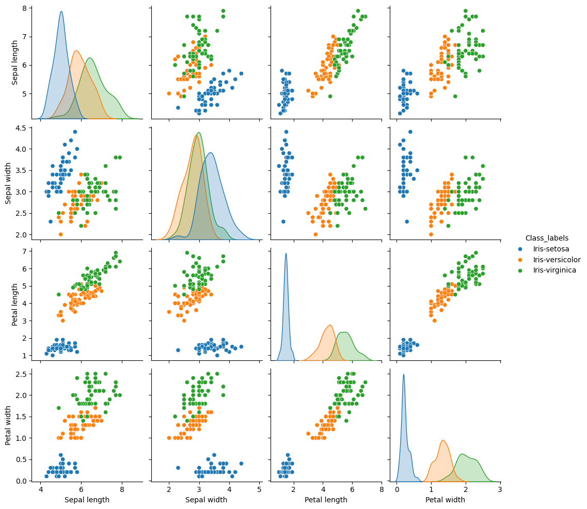
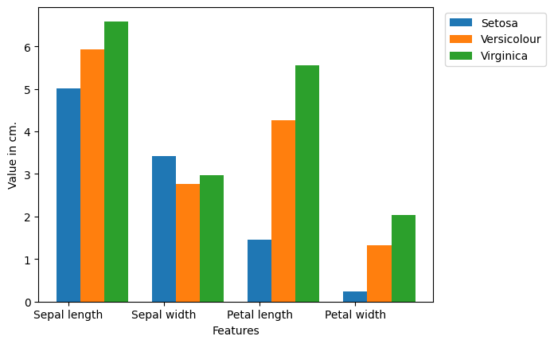
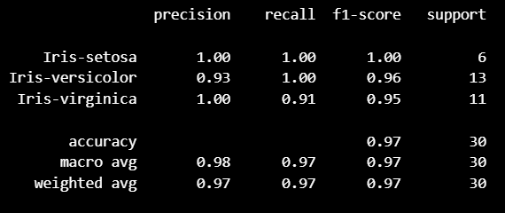

# Iris Flower Classification

This project is a **learning exercise** I completed while following the tutorial from [DataFlair](https://data-flair.training/blogs/iris-flower-classification/).  
My main goal was to **understand and practice the fundamentals of machine learning** using Python and the popular **Iris dataset**.

## Project Overview
The Iris dataset contains measurements of iris flowers — sepal length, sepal width, petal length, and petal width — for three different species:

- *Iris-setosa*
- *Iris-versicolor*
- *Iris-virginica*

The task is to **train a classification model** that predicts the species based on these measurements.

## Steps in the Notebook

1. **Import Libraries**  
   Used NumPy, Pandas, Matplotlib, Seaborn, and scikit-learn for data handling, visualization, and modeling.

2. **Load Dataset**  
   - Added column headers (`Sepal length`, `Sepal width`, `Petal length`, `Petal width`, `Class_labels`).
   - Checked the first rows and dataset structure.

3. **Exploratory Data Analysis (EDA)**  
   - Visualized distributions with Kernel Density Estimates (KDEs) and scatter plots.
   - Observed that petal measurements are better at separating species than sepal measurements.

   **Example KDE and Scatter Plots:**  
   

4. **Feature and Target Separation**  
   - Split the dataset into features (`X`) and target labels (`Y`).

5. **Per-Class Feature Averages**  
   - Calculated average feature values for each species.
   - Created grouped bar charts to visualize differences.

   **Example Grouped Bar Chart:**  
   

6. **Train/Test Split**  
   - Split the data into 80% training and 20% testing sets.

7. **Model Training**  
   - Used a Support Vector Machine (`SVC`) classifier from scikit-learn.
   - Trained it on the training set.

8. **Prediction and Evaluation**  
   - Predicted species for the test set.
   - Evaluated performance using:
     - Accuracy score
     - Classification report (precision, recall, F1-score)

## Results
- Achieved **97% accuracy** on the test set.
- Perfect classification for *Iris-setosa*.
- Very high scores for *Iris-versicolor* and *Iris-virginica*, with slight misclassification between the latter two.

**Example Classification Report:**  


## Requirements
Install dependencies with:
```bash
pip install numpy pandas matplotlib seaborn scikit-learn
```

## How to Run
1. Clone or download this repository.
2. Place the `iris.data` file in the same directory as the notebook.
3. Open the Jupyter Notebook:
   ```bash
   jupyter notebook iris_classification.ipynb
   ```
4. Run the cells in order.

## Acknowledgments
- Tutorial: [DataFlair - Iris Flower Classification](https://data-flair.training/blogs/iris-flower-classification/)
- Dataset: [UCI Machine Learning Repository - Iris](https://archive.ics.uci.edu/ml/datasets/iris)

## About the Author

<table border="0">
  <tr>
    <td>
      
    </td>
    <td align="left">
      <b>Felipe Viera Klein</b><br>
      Agricultural Engineer & Data Scientist<br>
      <a href="https://www.linkedin.com/in/felipevk/">🔗 LinkedIn</a> |
      <a href="https://github.com/Vierinsky">🐙 GitHub</a>
    </td>
  </tr>
</table>